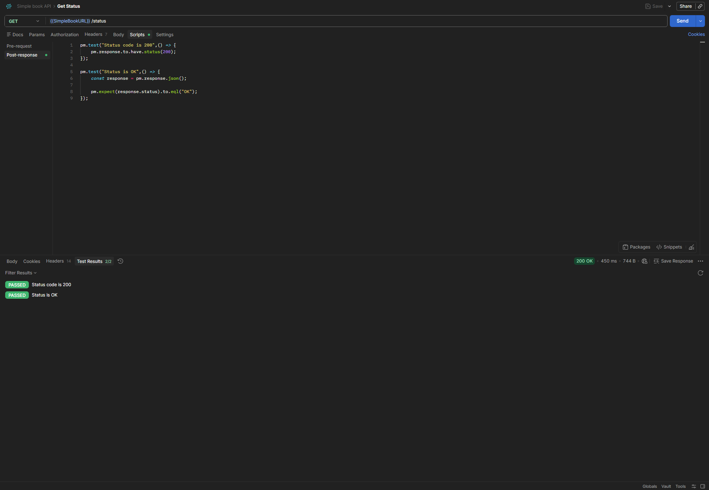

# GET - Get Status

## Endpoint

`GET {{SimpleBookURL}}/status`

## Expected Result

-   Status code: `200 OK`
-   Response contains status: `OK`

## Tests

``` javascript
pm.test("Status code is 200", () => {
    pm.response.to.have.status(200);
});

pm.test("Status is OK", () => {
    const response = pm.response.json();

    pm.expect(response.status).to.eql("OK");
});
```

## Result

All tests passed successfully.

-   Status code: `200 OK`
-   Test results: `2/2 PASSED`


