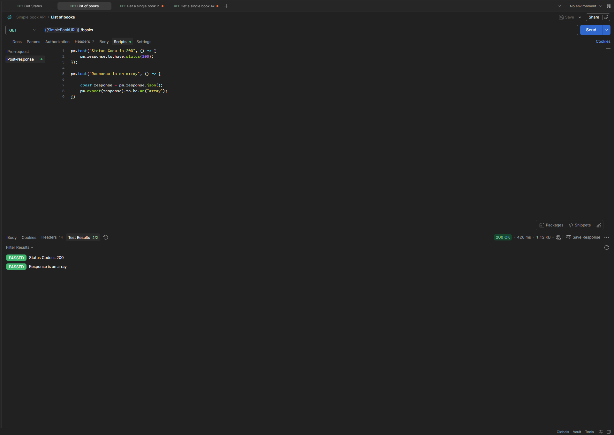

# GET - List of Books

## Endpoint

`GET {{SimpleBookURL}}/books`

## Expected Result

-   Status code: `200 OK`
-   Response body is an array

## Tests

``` javascript
pm.test("Status code is 200", () => {
    pm.response.to.have.status(200);
});

pm.test("Response is an array", () => {
    const response = pm.response.json();

    pm.expect(response).to.be.an("array");
});
```

## Result

All tests passed successfully.

-   Status code: `200 OK`
-   Test results: `2/2 PASSED`


