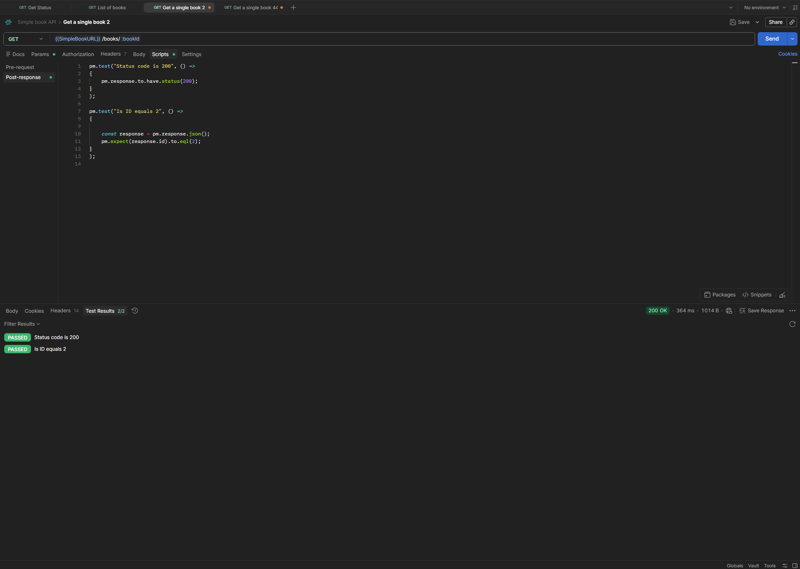

# GET - Get a Single Book (ID 2)

## Endpoint

`GET {{SimpleBookURL}}/books/:bookId`

## Test Data

-   `bookId`: `2`

## Expected Result

-   Status code: `200 OK`
-   Returned book ID equals `2`

## Tests

``` javascript
pm.test("Status code is 200", () => {
    pm.response.to.have.status(200);
});

pm.test("Is ID equals 2", () => {
    const response = pm.response.json();

    pm.expect(response.id).to.eql(2);
});
```

## Result

All tests passed successfully.

-   Status code: `200 OK`
-   Test results: `2/2 PASSED`


