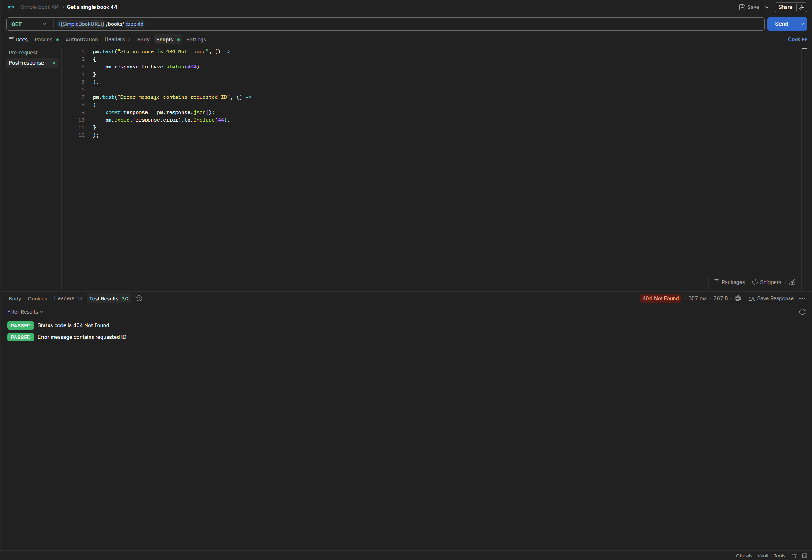

# GET - Get a Single Book (ID 44)

## Endpoint

`GET {{SimpleBookURL}}/books/:bookId`

## Test Data

-   `bookId`: `44`

## Expected Result

-   Status code: `404 Not Found`
-   Error message contains the requested ID

## Tests

``` javascript
pm.test("Status code is 404 Not Found", () => {
    pm.response.to.have.status(404);
});

pm.test("Error message contains requested ID", () => {
    const response = pm.response.json();

    pm.expect(response.error).to.include(44);
});
```

## Result

All tests passed successfully.

-   Status code: `404 Not Found`
-   Test results: `2/2 PASSED`



