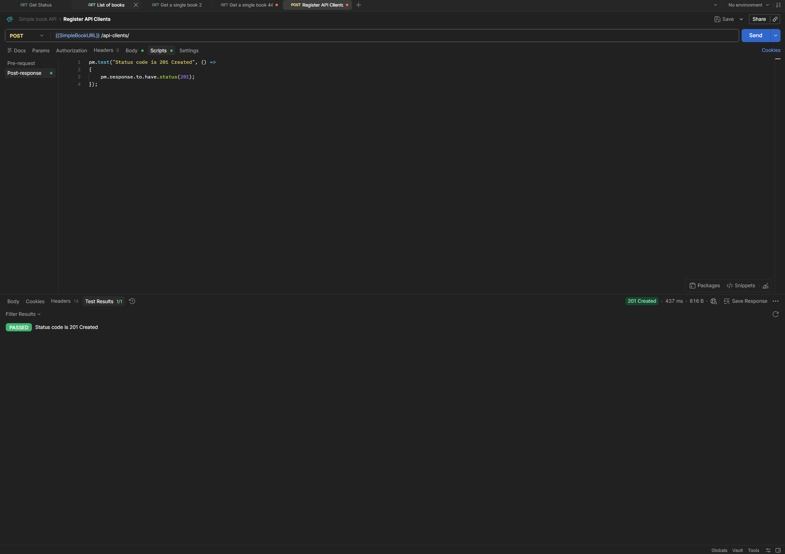

# POST - Register API Client

## Endpoint

`POST {{SimpleBookURL}}/api-clients/`

## Scenario

Valid API client registration.

## Expected Result

-   Status code: `201 Created`

## Test

``` javascript
pm.test("Status code is 201 Created", () => {
    pm.response.to.have.status(201);
});
```

## Result

Test passed successfully.

-   Status code: `201 Created`
-   Test results: `1/1 PASSED`


