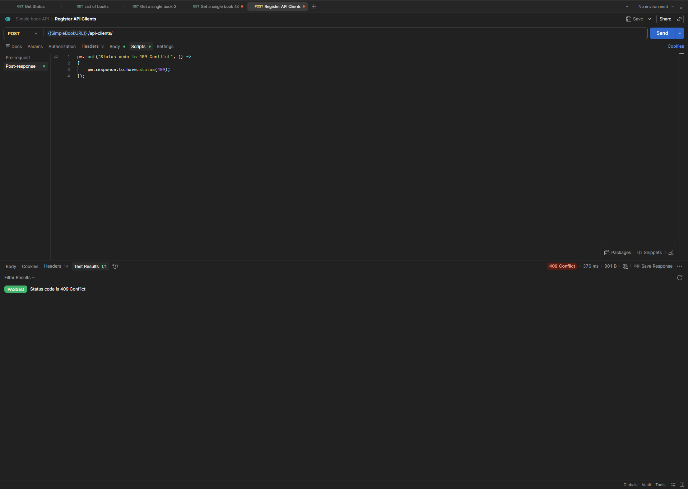

# POST - Register API Client - Conflict

## Endpoint

`POST {{SimpleBookURL}}/api-clients/`

## Scenario

Attempt to register an API client that already exists.

## Expected Result

-   Status code: `409 Conflict`

## Test

``` javascript
pm.test("Status code is 409 Conflict", () => {
    pm.response.to.have.status(409);
});
```

## Result

Test passed successfully.

-   Status code: `409 Conflict`
-   Test results: `1/1 PASSED`



