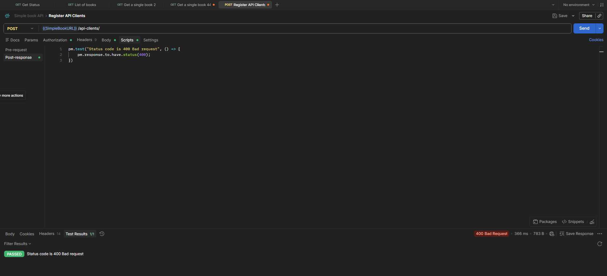

# POST - Register API Client - Bad Request

## Endpoint

`POST {{SimpleBookURL}}/api-clients/`

## Scenario

API client registration with invalid request data.

## Expected Result

-   Status code: `400 Bad Request`

## Test

``` javascript
pm.test("Status code is 400 Bad request", () => {
    pm.response.to.have.status(400);
});
```

## Result

Test passed successfully.

-   Status code: `400 Bad Request`
-   Test results: `1/1 PASSED`


