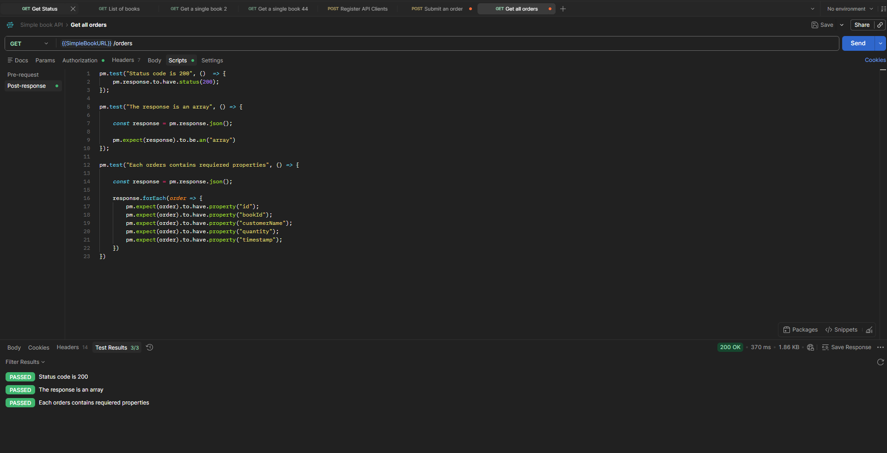

# GET - Get All Orders

## Endpoint

```http
GET {{SimpleBookURL}}/orders
```

## Expected Result

* Status code: `200 OK`
* Response is an array
* Each order contains the required properties:

  * `id`
  * `bookId`
  * `customerName`
  * `quantity`
  * `timestamp`

## Tests

```javascript
pm.test("Status code is 200", () => {
    pm.response.to.have.status(200);
});

pm.test("The response is an array", () => {
    const response = pm.response.json();

    pm.expect(response).to.be.an("array");
});

pm.test("Each orders contains required properties", () => {
    const response = pm.response.json();

    response.forEach(order => {
        pm.expect(order).to.have.property("id");
        pm.expect(order).to.have.property("bookId");
        pm.expect(order).to.have.property("customerName");
        pm.expect(order).to.have.property("quantity");
        pm.expect(order).to.have.property("timestamp");
    });
});
```

## Result

All tests passed successfully.

* Status code: `200 OK`
* Test results: `3/3 PASSED`




