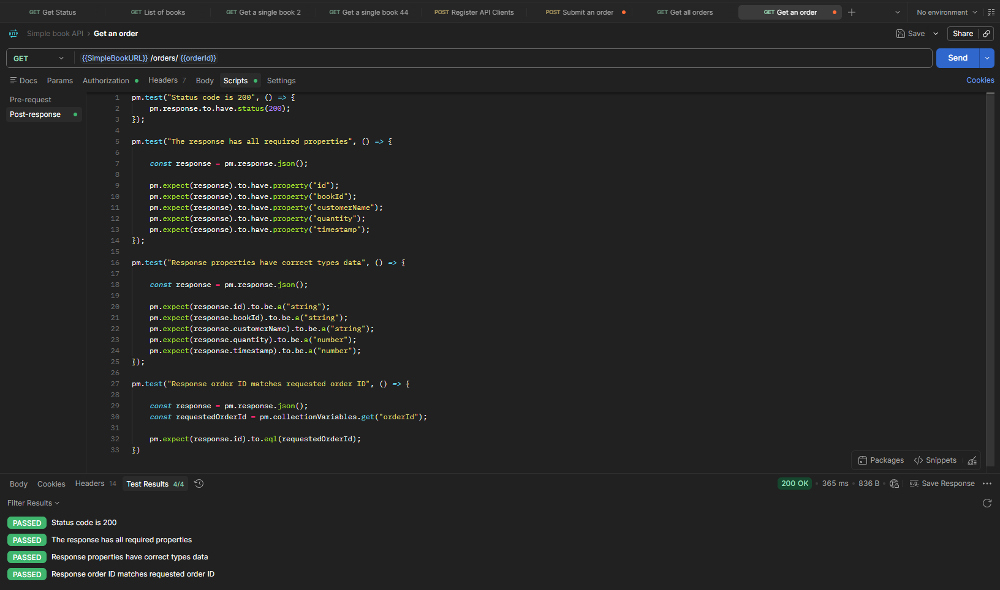

# GET – Get an Order

## Endpoint

```text
GET {{SimpleBookURL}}/orders/{{orderId}}
```

## Description

Retrieves details of a specific order using its unique order ID.

The `orderId` is stored automatically as a collection variable after creating a new order with the **POST – Submit an Order** request.

## Preconditions

* API client is registered and a valid access token is available.
* An existing order has been created.
* The `orderId` collection variable contains the ID of the created order.

## Test Cases

### 1. Verify status code

**Expected result:** The API returns status code `200 OK`.

```javascript
pm.test("Status code is 200", () => {
    pm.response.to.have.status(200);
});
```

### 2. Verify required response properties

**Expected result:** The response contains all required properties:

* `id`
* `bookId`
* `customerName`
* `quantity`
* `timestamp`

```javascript
pm.test("The response has all required properties", () => {
    const response = pm.response.json();

    pm.expect(response).to.have.property("id");
    pm.expect(response).to.have.property("bookId");
    pm.expect(response).to.have.property("customerName");
    pm.expect(response).to.have.property("quantity");
    pm.expect(response).to.have.property("timestamp");
});
```

### 3. Verify response property data types

**Expected result:** All response properties have the expected data types.

```javascript
pm.test("Response properties have correct types data", () => {
    const response = pm.response.json();

    pm.expect(response.id).to.be.a("string");
    pm.expect(response.bookId).to.be.a("number");
    pm.expect(response.customerName).to.be.a("string");
    pm.expect(response.quantity).to.be.a("number");
    pm.expect(response.timestamp).to.be.a("number");
});
```

### 4. Verify returned order ID

**Expected result:** The ID returned in the response matches the requested order ID.

```javascript
pm.test("Response order ID matches requested order ID", () => {
    const response = pm.response.json();
    const requestedOrderId = pm.collectionVariables.get("orderId");

    pm.expect(response.id).to.eql(requestedOrderId);
});
```

## Test Result

All automated tests passed successfully.

```text
✓ Status code is 200
✓ The response has all required properties
✓ Response properties have correct types data
✓ Response order ID matches requested order ID
```

## Screenshot


