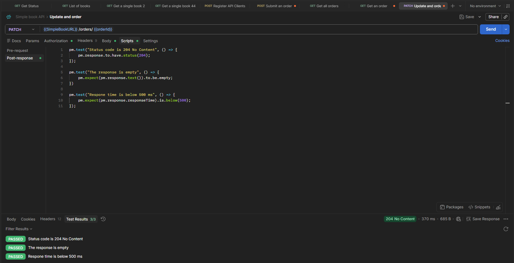

# PATCH – Update an Order

## Endpoint

**Method:** `PATCH`

**URL:**

```text
{{SimpleBookURL}}/orders/{{orderId}}
```

## Description

This endpoint updates an existing order. In this test, the customer's name is updated using a randomly generated value.

## Request Body

```json
{
  "customerName": "{{$randomFullName}}"
}
```

## Test Cases

### 1. Verify the status code

The response should return status code `204 No Content`.

```javascript
pm.test("Status code is 204 No Content", () => {
    pm.response.to.have.status(204);
});
```

### 2. Verify the response body is empty

Since the endpoint returns `204 No Content`, the response body should be empty.

```javascript
pm.test("The response is empty", () => {
    pm.expect(pm.response.text()).to.be.empty;
});
```

### 3. Verify the response time

The response time should be below `500 ms`.

```javascript
pm.test("Response time is below 500 ms", () => {
    pm.expect(pm.response.responseTime).to.be.below(500);
});
```

## Test Result

All tests passed successfully.


