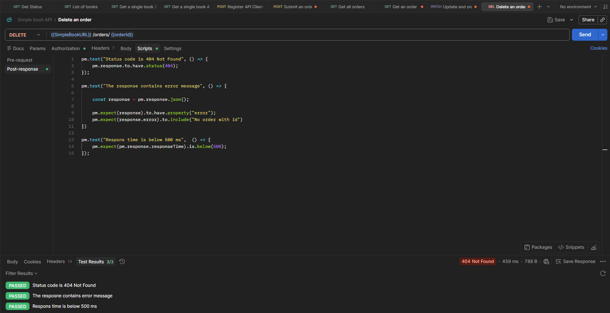

# DELETE – Delete Non-Existing Order

## Endpoint

```http
DELETE /orders/{{orderId}}
```

## Description

This test verifies the API behavior when attempting to delete an order that no longer exists.

The request uses an `orderId` stored as a collection variable. Since the order was previously deleted, the API should return an appropriate error response.

## Expected Result

* Status code is `404 Not Found`
* The response contains an `error` property
* The error message indicates that no order exists with the provided ID
* Response time is below `500 ms`

## Post-response Tests

```javascript
pm.test("Status code is 404 Not Found", () => {
    pm.response.to.have.status(404);
});

pm.test("The response contains error message", () => {
    const response = pm.response.json();

    pm.expect(response).to.have.property("error");
    pm.expect(response.error).to.include("No order with id");
});

pm.test("Response time is below 500 ms", () => {
    pm.expect(pm.response.responseTime).to.be.below(500);
});
```

## Test Results

All tests passed successfully:

* Status code is `404 Not Found`
* The response contains an appropriate error message
* Response time is below `500 ms`

**Result: 3/3 tests passed**

## Screenshot


