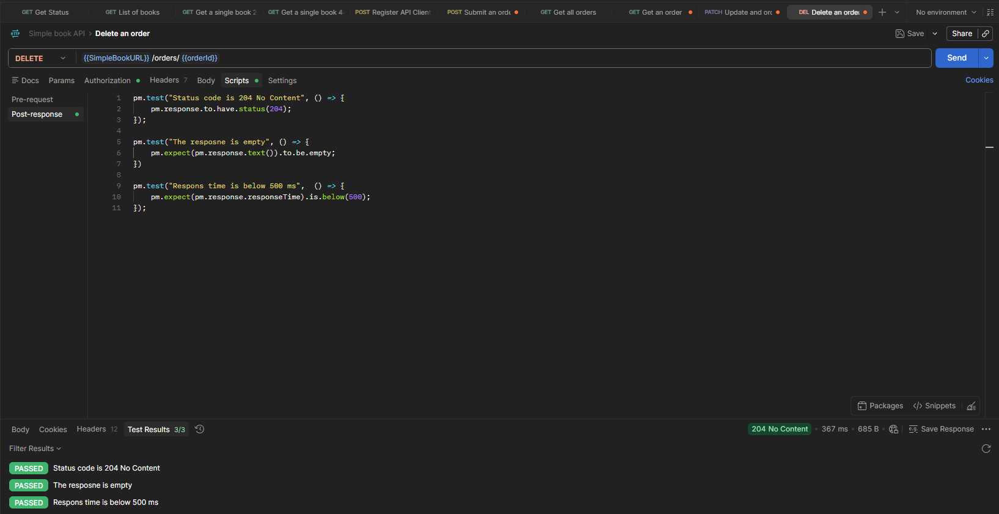

# DELETE – Delete Existing Order

## Endpoint

```http
DELETE /orders/{{orderId}}
```

## Description

This test verifies whether an existing order can be successfully deleted.

The request uses an `orderId` stored as a collection variable. The order ID is automatically updated after creating a new order using the `POST /orders` endpoint.

## Expected Result

* Status code is `204 No Content`
* The response body is empty
* Response time is below `500 ms`

## Post-response Tests

```javascript
pm.test("Status code is 204 No Content", () => {
    pm.response.to.have.status(204);
});

pm.test("The response is empty", () => {
    pm.expect(pm.response.text()).to.be.empty;
});

pm.test("Response time is below 500 ms", () => {
    pm.expect(pm.response.responseTime).to.be.below(500);
});
```

## Test Results

All tests passed successfully:

* Status code is `204 No Content`
* The response body is empty
* Response time is below `500 ms`

**Result: 3/3 tests passed**

## Screenshot


