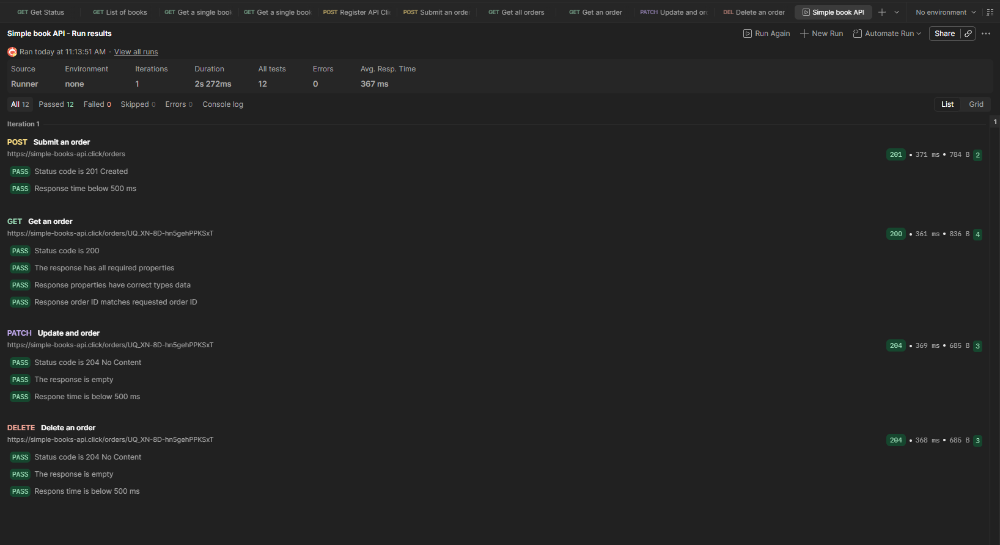

# Collection Runner

Automated CRUD workflow executed using Postman's Collection Runner.

```text
POST Submit an order
        ↓
GET Get an order
        ↓
PATCH Update an order
        ↓
DELETE Delete an order
```

The `orderId` generated during the POST request is stored as a Collection Variable and automatically used by the following requests.

## Results

* Total tests: **12**
* Passed: **12**
* Failed: **0**


