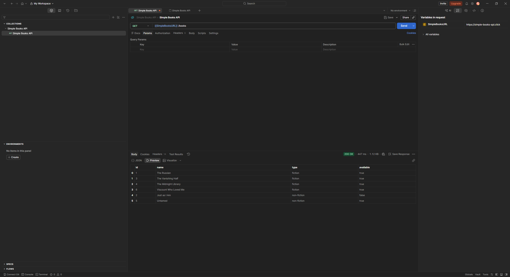

# GET /book RESULTS

## Summary

The endpoint was successfully tested

### Verified

- HTTP Status Code is 200
- Response contains 6 books
- Every object contains:
  - id
  - name
  - type
  - available
- Field "available" contains only boolean values ("true"/"false")
- Field "type" contains only "fiction" or "non-fiction"

## Result

All positive test scenarios passed

No issues found

